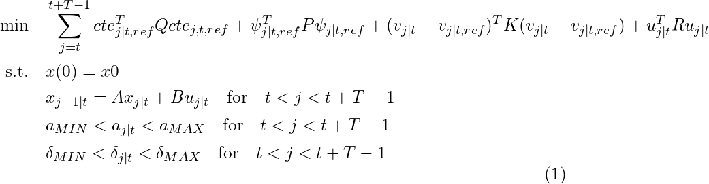
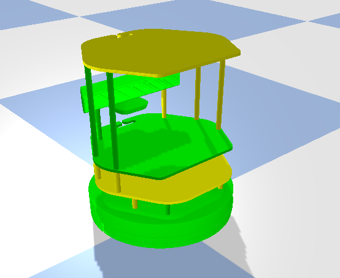

# mpc_python

Python implementation of a mpc controller for path tracking using **[CVXPY](https://www.cvxpy.org/)**.

## About

The MPC is a model predictive path following controller which does follow a predefined reference path Xref and Yref by solving an optimization problem. The resulting optimization problem is shown in the following equation:



The vehicle dynamics are described by the differential drive model:


The state variables of the model are:

* **x** coordinate of the robot
* **y** coordinate of the robot
* **theta** heading of the robot

The inputs of the model are:

* **v** linear velocity of the robot
* **w** angular velocity of the robot

## Demo

The MPC implementation is tested using **[bullet](https://pybullet.org/wordpress/)** physics simulator.



Results:


To run the pybullet demo:

```bash
python3 mpc_demo/mpc_demo_pybullet.py
```

To run the simulation-less demo:

```bash
python3 mpc_demo/mpc_demo_pybullet.py
```

## Requirements

```bash
pip3 install --user --requirement requirements.txt
```
