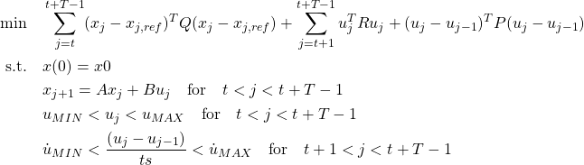
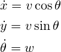
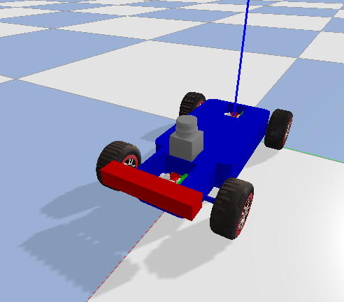
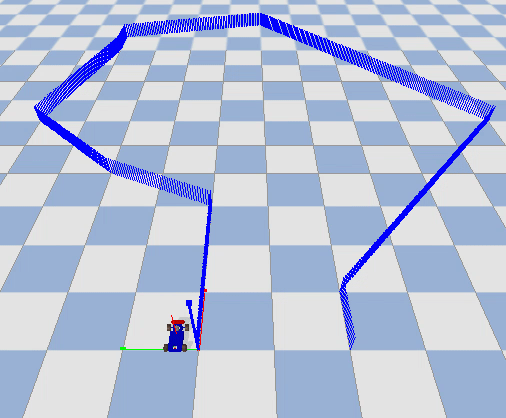
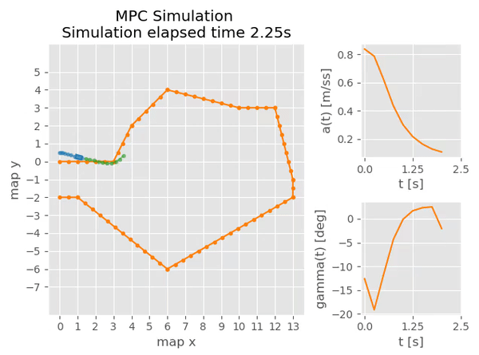

# mpc_python

I keep here my Jupyter notebooks on R&D on Model Predictive Control applyied to path-following problems in driverless vehicles. Includes also a Pybullet simulation to showcase the results. 
This mainly uses **[CVXPY](https://www.cvxpy.org/)** as a framework. This repo contains code from other projecs, check them out in the special thanks section.

## Contents

### Usage

From within the `mpc_pybullet_demo` directory:

* To run the pybullet demo:
```bash
python3 mpc_demo_pybullet.py
```

* To run the simulation-less demo (simpler demo that does not use pybullet, useful for debugging):
```bash
python3 mpc_demo_pybullet.py
```

In both cases the script will promt the user for `enter` before starting the demo.

The settings for tuning the MPC controller are in the **[mpc_config](./mpc_pybullet_demo/mpcpy/mpc_config.py)** class.

### Jupyter Notebooks

1. State space model derivation -> analytical and numerical derivaion of the model

2. MPC -> implementation and testing of various tweaks/improvements

3. Obstacle Avoidance -> Using halfplane constrains to avaoid track collisions -> Sill **work in progress**!

<!--nobody cares about this 
## About

The MPC is a model predictive path following controller which does follow a predefined reference by solving an optimization problem. The resulting optimization problem is shown in the following equation:



The terns of the cost function are the sum of the **reference tracking error**, **heading effort** and **actuaction rate of change**.

Where R,P,Q are the cost matrices used to tune the response.

The vehicle model is described by the bicycle kinematics model using the state space matrices A and B:



The state variables **(x)** of the model are:

* **x** coordinate of the robot
* **y** coordinate of the robot
* **v** velocuty of the robot
* **theta** heading of the robot

The inputs **(u)** of the model are:

* **a** linear acceleration of the robot
* **delta** steering angle of the robot
-->

### Results

Racing car model is from: *https://github.com/erwincoumans/pybullet_robots*.



Results:






### Requirements

The environment can be repoduced via [conda](https://www.anaconda.com/products/distribution):
```bash
conda env create -f env.yml
conda activate simulation
```

The dependencies for just the python scripts can also be installed using `pip`:
```bash
pip3 install --user --requirement requirements.txt
```

## References & Special Thanks :star: :
* [Prof. Borrelli - mpc papers and material](https://borrelli.me.berkeley.edu/pdfpub/IV_KinematicMPC_jason.pdf)
* [AtsushiSakai - pythonrobotics](https://github.com/AtsushiSakai/PythonRobotics/)
* [erwincoumans - pybullet](https://pybullet.org/wordpress/)
* [alexliniger - mpcc](https://github.com/alexliniger/MPCC) and his [paper](https://onlinelibrary.wiley.com/doi/abs/10.1002/oca.2123)
* [arex18 - rocket-lander](https://github.com/arex18/rocket-lander)
